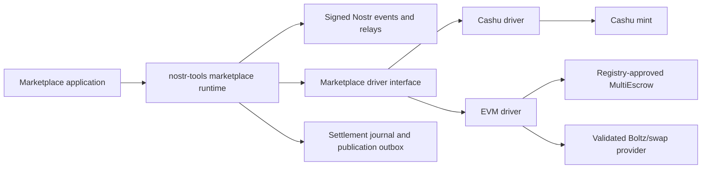

# NMDK architecture

NMDK is a pinned integration snapshot, not a monolithic package. Nostr events
coordinate marketplace intent; payment drivers independently prove that funds
are locked or moved according to exact verified terms.

## Trust boundaries

- Relays are untrusted storage and transport. Events must be signed, parsed,
  schema-checked, and cross-bound to the listing, participants, and payment.
- Proof parameters are untrusted. EVM addresses and bytecode hashes come from
  configured policy, never from the proof being validated. Cashu locks require
  exact keys, tags, threshold, unit, mint, and amount.
- Swap providers are untrusted coordinators. Every returned call is locally
  decoded and checked before execution; discovery is restricted to configured
  contracts and code hashes.
- Browser storage is attacker-readable after an origin compromise. It may hold
  public progress metadata, but never an `nsec`, seed, private key, preimage, or
  bearer proof.
- Storage adapters are caller-owned durability boundaries. Writes must be
  durable before the next external effect and compare-and-set where concurrent
  execution is possible.

## Package responsibilities

| Package | Owns | Must not own |
| --- | --- | --- |
| Driver interface | Terms, proof sensitivity, lifecycle and storage contracts | Chain or mint implementation |
| Nostr runtime | Event validation, route selection, journaling, publication | Custodial secrets or payment-provider trust |
| Cashu driver | Exact P2PK locks, mint operations, recovery metadata | Relay publication or long-lived bearer-proof storage |
| EVM driver | Registry-bound validation, transaction/swap recovery | Trust in proof-supplied contracts or provider call bundles |
| Contract package | Solidity source, reproducible ABI/bytecode registry | Off-chain route selection |
| Application | User intent and signer connection | Persistent raw signing keys or Cashu proofs |

Protocol changes begin in normative drafts and conformance vectors. Package
implementations consume those vectors; documentation describes the released
behavior rather than defining a competing protocol.
