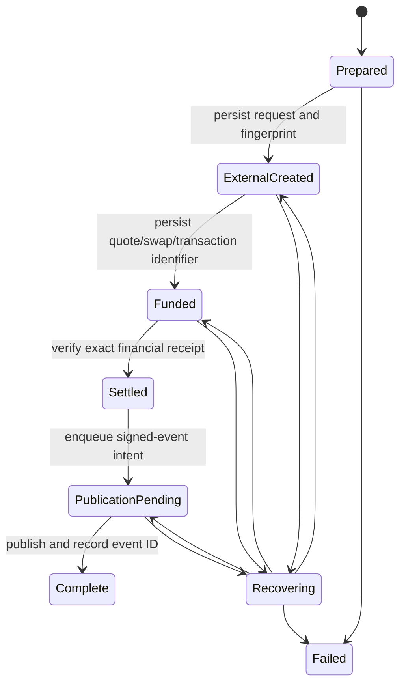

# State, idempotency, and recovery

Every fund-moving request has a deterministic operation ID and a canonical
request fingerprint. Storage must provide atomic create-if-absent or
compare-and-set behavior when more than one worker can process an operation.

Cashu records retain mint, unit, derivation version/index, quote identifier,
request fingerprint, status, and public receipts only. Proofs exist in memory
only while required to complete a spend or sealed handoff and are removed from
terminal records.

Compact completed-operation tombstones and signed settlement outboxes are not
deleted by an elapsed-time heuristic: doing so would weaken late-retry
idempotency. Archival is an explicit operator action after the protocol's full
financial and dispute horizon, with immutable events and external receipts
retained for reconciliation.

Cashu auction bids include canonical buyer-signed promotion and 100%-refund
swap commitments. The arbiter may execute only those exact outputs. A lost
mint response is recovered with NUT-09 using the same operation ID and blinded
outputs; the resulting buyer proof remains secret and is delivered only as a
whole-proof sealed payload.

EVM records retain chain, configured contract identity, account/index,
swap/provider ID, transaction or user-operation hashes, confirmations, request
fingerprint, and public receipts. Private keys and preimages are re-derived by
the caller-owned seed provider and are never serialized by the operation
store.

Startup recovery must reconcile the authoritative mint, provider, and chain
state before changing local status. Unknown or contradictory external state is
quarantined for operator review rather than guessed. Recovery emits or queues
the same publication-ready proof as the uninterrupted path.
